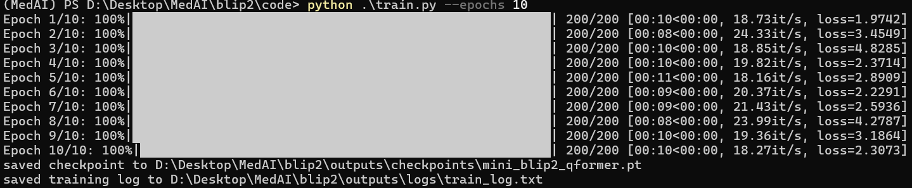

# Mini-BLIP2 图像描述生成复现实验报告

## 1. 论文信息

- 论文名称：BLIP-2: Bootstrapping Language-Image Pre-training with Frozen Image Encoders and Large Language Models
- 论文地址：https://arxiv.org/abs/2301.12597

## 2. 任务说明

本实验复现的任务是图像描述生成 Image Captioning。

输入：图片  
输出：英文 caption

本次复现不是完整复现原论文的大规模预训练流程，而是实现一个轻量化 Mini-BLIP2。实验重点是搭建类似 BLIP-2 的核心结构，并在 Flickr8k 前 200 张图片上跑通从图像输入到 caption 生成的端到端流程。

## 3. 数据集

- 数据集名称：Flickr8k
- 数据集地址：https://www.kaggle.com/datasets/adityajn105/flickr8k
- 实际使用数据量：前 200 张图片
- 图片目录：`data/Image`
- 标注文件：`data/captions.txt`

Flickr8k 中每张图片对应 5 条英文 caption。代码中先按照图片文件名建立 caption 映射，训练时每次从该图片对应的 5 条 caption 中随机选取 1 条作为当前训练目标。这样仍然保持了“一张图片对应一句 caption”的简单训练接口，同时让模型在不同 epoch 中可能看到同一张图的不同描述。

## 4. 模型结构

本实验实现的 Mini-BLIP2 结构如下：

```text
Image
  -> Frozen CLIP Vision Encoder
  -> Trainable Mini Q-Former
  -> Trainable Projection Layer
  -> Frozen OPT Language Decoder
  -> Caption
```

整体模型定义在 `code/model.py` 中，主要包含 `CLIPVisionEncoder`、`MiniQFormer`、`MiniOPT` 和 `MiniBLIP2` 四个部分。

### 4.1 Vision Encoder

- 使用模型：`openai/clip-vit-base-patch32`
- 实现类：`CLIPVisionEncoder`
- 输入：PIL Image 图片
- 输出：CLIP vision hidden states
- 冻结方式：将 CLIP 视觉编码器全部参数设置为 `requires_grad = False`

CLIP 视觉编码器负责把输入图片编码为视觉 token 特征。本实验不训练 CLIP，只使用其预训练视觉表示能力。

### 4.2 Mini Q-Former

本实验实现了一个简化版 Mini Q-Former：

- query token 数量：32
- hidden size：768
- Transformer 层数：2
- attention heads：8
- 是否使用 cross-attention：是
- projection layer：`nn.Linear(768, 768)`

每层 `MiniQFormerLayer` 包含：

- query self-attention；
- query 对 image embeddings 的 cross-attention；
- feed-forward network；
- residual connection 和 LayerNorm。

Mini Q-Former 的作用是使用一组可学习 query tokens 从 CLIP 图像特征中提取信息，然后通过 projection layer 映射到 OPT 的词向量空间。

### 4.3 Language Decoder

- 使用模型：`facebook/opt-125m`
- 实现类：`MiniOPT`
- 冻结方式：将 OPT 全部参数设置为 `requires_grad = False`
- 输入方式：使用 `inputs_embeds`，把 Q-Former 输出拼接到 caption token embeddings 前面

训练时，Q-Former 输出部分对应的 labels 设置为 `-100`，只对 caption 文本部分计算 cross entropy loss。这样训练目标集中在让 Q-Former 和 projection layer 学会产生适合 OPT 解码的视觉前缀。

## 5. 训练设置

- 训练数据量：Flickr8k 前 200 张图片
- epoch：10
- batch size：1
- learning rate：`1e-4`
- optimizer：AdamW
- loss function：OPT causal language modeling cross entropy loss
- 冻结的模块：CLIP Vision Encoder、OPT Language Decoder
- 训练的模块：Mini Q-Former、Projection Layer
- checkpoint 保存路径：`outputs/checkpoints/mini_blip2_qformer.pt`
- 训练日志路径：`outputs/logs/train_log.txt`

训练脚本为 `code/train.py`。每一步训练流程为：读取图片和随机 caption，经过 CLIP 得到图像特征，Mini Q-Former 提取视觉信息并投影到 OPT embedding 维度，再与 caption token embeddings 拼接后送入 frozen OPT 计算 loss。

## 6. 训练过程

训练 10 个 epoch 后，平均 loss 整体下降，从第 1 个 epoch 的 3.593067 降到第 10 个 epoch 的 2.431528。说明 Mini Q-Former 与 projection layer 能够学习到一定的图文对齐能力。

| Epoch | Train Loss |
|---|---:|
| 1 | 3.593067 |
| 2 | 3.170276 |
| 3 | 3.066366 |
| 4 | 2.963100 |
| 5 | 2.827374 |
| 6 | 2.864060 |
| 7 | 2.672249 |
| 8 | 2.599810 |
| 9 | 2.516051 |
| 10 | 2.431528 |

部分训练日志如下：

```text
epoch=1, avg_loss=3.593067
epoch=2, avg_loss=3.170276
epoch=3, avg_loss=3.066366
epoch=4, avg_loss=2.963100
epoch=5, avg_loss=2.827374
epoch=6, avg_loss=2.864060
epoch=7, avg_loss=2.672249
epoch=8, avg_loss=2.599810
epoch=9, avg_loss=2.516051
epoch=10, avg_loss=2.431528
```
截图如下:


完整训练日志保存在 `outputs/logs/train_log.txt`。

## 7. 生成结果展示

生成脚本为 `code/generate.py`。生成时加载训练后的 Q-Former checkpoint，并使用 `"A photo of"` 作为 OPT 的文本起始提示。结果保存在 `outputs/samples/generated_captions.md`。

| 图片编号 | 真实 Caption | 模型生成 Caption |
|---|---|---|
| 1000268201_693b08cb0e.jpg | A little girl in a pink dress going into a wooden cabin . | a boy in a yellow shirt . A little girl is walking down the street . She's wearing a |
| 1001773457_577c3a7d70.jpg | A black dog and a spotted dog are fighting | a dog . A black dog is running in the background . The dog is chasing a brown dog . |
| 1002674143_1b742ab4b8.jpg | A little girl covered in paint sits in front of a painted rainbow with her hands in a bowl . | a girl in pink and blue with her hands on the ground . A little boy is sitting in front |
| 1003163366_44323f5815.jpg | man laying on bench holding leash of dog sitting on ground | a man and a dog . A black dog is sitting on the bench . The dog is in front |
| 1007129816_e794419615.jpg | A man in an orange hat starring at something . | a man wearing a hat . He is sitting in front of the camera . The man is wearing glasses |

从结果可以看出，模型已经能够生成与图像大致相关的英文短句，例如 dog、girl、man 等关键词能够出现。但由于本实验只使用 200 张图片，并且冻结了 CLIP 和 OPT，仅训练了较小的 Q-Former，因此生成结果仍然存在语义不够准确、句子重复、结尾不完整等问题。

## 8. 总结

本实验成功跑通了一个简化版 BLIP-2 图像描述生成流程。代码完成了 Flickr8k 数据读取、CLIP 视觉编码器接入、Mini Q-Former 实现、projection layer、frozen OPT 解码器、训练脚本和生成脚本。

训练过程中只更新 Mini Q-Former 与 projection layer，CLIP 和 OPT 均被冻结。经过 10 个 epoch 训练后，平均 loss 从 3.593067 降至 2.431528，说明模型能够学习到一定的视觉到语言空间的映射。

生成结果可以产生基本英文描述，并能部分捕捉图像中的人物、动物等主要对象。但由于数据量较小、模型结构简化、没有进行 BLIP-2 原论文中的大规模预训练，生成 caption 仍存在重复和语义偏差。后续如果继续改进，可以增加训练数据量、使用更多 caption、改进生成策略，例如 beam search、repetition penalty、no-repeat ngram，也可以尝试更完整的 Q-Former 结构。

## 9. AI 对话过程记录

- 录制工具：ChatGPT 分享链接
- 对话链接：https://chatgpt.com/g/g-p-6a0dd3a84cd48191a352d865b252d9d8-fu-xian-blip2lun-wen/project
- 使用的 AI 模型：ChatGPT
- 累计对话时长 / 会话数：10 / 4

AI 主要在代码结构分析、Dataset 修正、Mini-BLIP2 训练流程串联、loss 计算、生成脚本调试和报告整理方面提供帮助。实际训练、运行日志、生成结果和项目调试过程均基于本地代码与本地环境完成。在实现过程中，也根据训练结果和生成现象对代码做了多次调整，例如从固定取第一条 caption 改为每张图随机取一条 caption。

## 10. Git 提交记录

- 仓库地址：https://github.com/Real-s/blip2.git
- 总 commit 数：11

`git log --oneline` 输出如下：

```text
625255a Day6: 1.编写训练脚本train.py 以及 测试脚本generate.py 2.进行模型训练以及测试
2dc4841 Day5: 1.引入OPT语言解码器，测试可用
092545b Day4: 1.编写MiniQFormer(不太确定) 2.图像特征里取信息 3.添加 projection layer 对齐到 OPT 词向量空间
a9cc94c Day3: 1.引入CLIP视觉编码器，编写CLIPVisionEncoder 2.引入GPU部署 3.冻结CLIP
f4a8fdc Day2: 1.熟悉transforms、dataset等库 2.编写dataset.py 3.完成图片路径读取以及caption读取
8ba353e Day1: 初始化 BLIP-2 学习环境
b6011ba Translate README to Chinese and document data/ folder
edac08a Add empty data/ placeholder
674cc47 Add code/ placeholder so the directory appears in the repo
54a0028 Add anti-cheat requirements: AI chat log and granular git commits
d6cb42d Add Mini-BLIP2 reproduction brief
```
